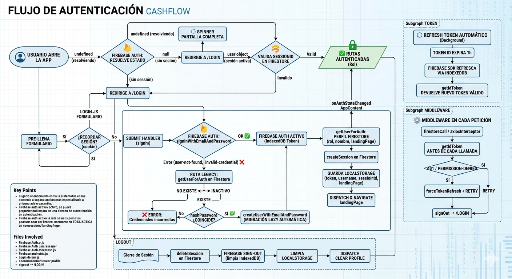

# My Admin — Cash Flow Dashboard

> Panel de administración de flujo de caja personal, construido sobre React 18 + Vite con integración a Google Apps Script y Firebase Firestore.

[](https://react.dev)
[](https://vitejs.dev)
[](https://redux-toolkit.js.org)
[](https://firebase.google.com)
[](LICENSE)

---

## Tabla de contenidos

- [Descripción](#descripción)
- [Características](#características)
- [Arquitectura](#arquitectura)
- [Autenticación](#autenticación)
- [Estructura del proyecto](#estructura-del-proyecto)
- [Instalación y comandos](#instalación-y-comandos)
- [Backend y fuentes de datos](#backend-y-fuentes-de-datos)
- [Sistema de temas](#sistema-de-temas)
- [Estado global (Redux)](#estado-global-redux)
- [Internacionalización](#internacionalización)
- [Caché de vouchers](#caché-de-vouchers)
- [Rutas y archivos](#rutas-y-archivos)
- [Despliegue](#despliegue)

---

## Descripción

**My Admin** es un dashboard SPA para la gestión de cuentas, pagos y comprobantes (vouchers) de flujo de caja. Permite visualizar el estado de pago de cuentas por mes/año, adjuntar vouchers en imagen o PDF, y consultar reportes históricos. Está desplegado en GitHub Pages y consume dos backends: Google Apps Script (datos de pagos) y Firebase Firestore (vouchers).

---

## Características

| Módulo | Descripción |
|---|---|
| **Pagos** | Grid de cuentas con detalle de pagos por mes/año, estado pagado/pendiente |
| **Vouchers** | Subida de imagen o PDF (convertido a imagen), almacenado en Firestore |
| **Reportes** | Visualización histórica de comprobantes de pago |
| **Cuentas** | CRUD de cuentas con DataGrid DevExtreme |
| **Visitas** | Registro de visitas a la página pública About Me (Firebase) |
| **Temas** | Selector de tema en el header: Cash (negro/ámbar) y Ocean (azul/esmeralda) |
| **i18n** | Soporte multilenguaje (Español por defecto) con i18next |

---

## Arquitectura

```
Browser (HashRouter)
│
├── DefaultLayout                  ← AppSidebar + AppHeader + AppContent + AppFooter
│   ├── Payments (movements)       ← Google Apps Script + Firebase Firestore
│   ├── Reports                    ← Firebase Firestore
│   ├── Accounts                   ← Google Apps Script / DevExtreme DataGrid
│   └── Tools / Visits             ← Firebase Firestore
│
└── Public pages (sin layout)
    ├── /login
    ├── /register
    ├── /404
    └── /about-me                  ← Portfolio público con Matrix rain + cursor glow
```

**Flujo de datos:**

```
Component
  └─► dispatch(action)
        └─► Redux Saga (side effect)
              ├─► Google Apps Script API  (FormData POST)
              └─► Firebase Firestore SDK
                    └─► reducer update ─► component re-render
```

---

## Autenticación



El sistema usa **Firebase Auth (email/password)** con una estrategia híbrida de migración lazy: intenta autenticar con Firebase Auth primero; si el usuario aún no existe allí, verifica contra el hash legacy en Firestore y crea la cuenta en Firebase Auth automáticamente, sin intervención del admin.

| Etapa | Descripción |
|---|---|
| **Arranque** | `onAuthStateChanged` resuelve la sesión desde IndexedDB antes de renderizar rutas |
| **Login normal** | `signInWithEmailAndPassword` → perfil Firestore → session record |
| **Login legacy** | Hash Firestore → migración automática a Firebase Auth |
| **Session validation** | Verifica el `sessionId` en Firestore al arrancar (previene sesiones robadas) |
| **Refresh token** | Firebase SDK lo maneja automáticamente en IndexedDB — sin código manual |
| **Middleware** | Cada llamada a Firestore/API inyecta un token fresco; en 401 fuerza refresh y reintenta |
| **Logout** | Elimina sesión en Firestore + `Firebase signOut` (invalida IndexedDB) + limpia localStorage |

> Ver diagrama interactivo completo en [`docs/login-flow.md`](docs/login-flow.md).

---

## Estructura del proyecto

```
src/
├── actions/              # Creadores de acciones (redux-act)
│   ├── authActions.js
│   ├── accountActions.js
│   ├── paymentActions.js
│   └── paymentVaucherActions.js
│
├── reducers/             # Slices de estado (RTK createSlice)
│   ├── loginReducer.js
│   ├── accountReducer.js
│   ├── paymentReducer.js
│   ├── paymentVaucherReducer.js
│   └── uiReducer.js      ← sidebarShow, appTheme
│
├── sagas/                # Efectos asíncronos (redux-saga)
│   ├── accountSagas.js
│   ├── paymentSagas.js
│   └── paymentVaucherSagas.js   ← lógica de caché de vouchers
│
├── services/
│   ├── providers/
│   │   ├── api/          ← Google Apps Script (utilApi.js, payments.js, accounts.js)
│   │   └── firebase/     ← Firestore (paymentVaucher.js, settings.js, pageVisits.js)
│   └── voucherCache.js   ← Caché en localStorage con prefijo vchr_
│
├── components/           # Componentes de layout compartidos
│   ├── AppHeader.js      ← Selector de tema, language switcher, banner de versión
│   ├── AppSidebarNav.js
│   ├── AppBreadcrumb.js
│   └── LanguageSwitcher.js
│
├── views/
│   ├── movements/payments/   ← Gestión de pagos + subida de vouchers
│   ├── reports/payments/     ← Visor de comprobantes
│   ├── managment/accounts/   ← CRUD de cuentas
│   ├── tools/visits/         ← Registro de visitas
│   └── pages/
│       ├── login/
│       └── aboutMe/          ← Portfolio público (Matrix rain, cursor glow)
│
├── scss/
│   ├── _custom.scss      ← Mixin app-theme + temas Cash y Ocean
│   └── _variables.scss
│
├── _nav.js               # Configuración del menú lateral
├── routes.js             # Definición de rutas
└── store/store.js        # Configuración del store Redux
```

---

## Instalación y comandos

```bash
# Instalar dependencias
npm install

# Servidor de desarrollo (http://localhost:3000)
npm start

# Build de producción → /build
npm run build

# Preview del build
npm run serve

# Lint
npm run lint

# Deploy a GitHub Pages (build + gh-pages)
npm run deploy
```

> **Nota:** Al iniciar la app se imprime en consola el hash del commit actual (`[app] commit: xxxxxxx`), útil para verificar la versión desplegada.

---

## Backend y fuentes de datos

### Google Apps Script

Todas las operaciones de cuentas y pagos van a un endpoint de Google Apps Script mediante `POST` con `FormData`:

```js
// src/services/providers/api/utilApi.js
FormData {
  action: 'getAccounts' | 'getPayments' | 'createPayment' | ...,
  token:  localStorage.getItem('token'),
  ...params
}
```

La autenticación se basa en un token guardado en `localStorage`. Si no existe, el guard de `AppContent.js` redirige a `/login`.

### Firebase Firestore

Usado exclusivamente para vouchers de pago y registro de visitas:

| Colección | Uso |
|---|---|
| `paymentVauchers` | Imágenes/PDF de comprobantes de pago (base64) |
| `page_visits` | Registro de visitas a la página About Me |

---

## Sistema de temas

El tema se aplica mediante el atributo `data-app-theme` en el `<body>` y se persiste en Redux (`uiReducer`). Los estilos están definidos en `src/scss/_custom.scss` con un mixin reutilizable:

```scss
@mixin app-theme($bg, $accent) { ... }

body[data-app-theme="yellow"] { @include app-theme(#000000, #ffc107); } // Cash
body[data-app-theme="blue"]   { @include app-theme(#1e3a5f, #10b981); } // Ocean
```

El mixin aplica el acento (`$accent`) a:
- Sidebar: links activos, hover, ítem activo con borde izquierdo
- Botones primarios de CoreUI
- Botones default de DevExtreme (toolbar y standalone)

El selector de tema está en el header (ícono de paleta).

---

## Estado global (Redux)

```
store
├── login          → { fetching, token, isError, error }
├── account        → { data, selectedAccount, fetching, isError, error }
├── payment        → { fetching, isError, error }
├── paymentVaucher → { data, fetching, isError, error }
└── ui             → { sidebarShow, appTheme }
```

**Sagas registradas:**

| Saga | Trigger | Acción |
|---|---|---|
| `fetchAccountsSaga` | `accountActions.fetchData` | GET cuentas desde Apps Script |
| `addVauchersToAccountPayments` | `accountActions.loadVauchersToAccountPayment` | Carga vouchers con caché |
| `createPaymentSaga` | `paymentActions.createRequest` | POST nuevo pago |
| `createPaymentVaucher` | `paymentActions.successRequestCreate` | Guarda voucher en Firestore |

---

## Internacionalización

Configurado con `i18next` + `i18next-http-backend`. Idioma por defecto: **español (`es`)**.

Los archivos de traducción se cargan vía HTTP desde `public/locales/`. Para agregar un idioma nuevo, crea `public/locales/<lang>/translation.json` y agrégalo en `src/i18n.js`.

---

## Caché de vouchers

Los vouchers se cachean en `localStorage` con el prefijo `vchr_<paymentId>` para evitar lecturas repetidas a Firestore.

```
Primera carga
  └─► getCache(paymentId) → null
        └─► fetchVaucherPaymentMultiple() → Firestore
              └─► setCache(paymentId, base64)  ← guardado

Cargas siguientes
  └─► getCache(paymentId) → base64  ← sirve inmediatamente, sin Firestore
```

Para forzar recarga de un voucher individual existe el botón de refresh (⟳) en cada card de pago, que llama a `clearCache(paymentId)` antes de ir a Firestore.

---

## Rutas y archivos

Mapa de cada ruta de la aplicación al archivo fuente que la renderiza.

| Ruta (`#/...`) | Archivo fuente | Notas |
|---|---|---|
| `/cash_flow/dashboard` | `src/views/pages/dashboard/Dashboard.js` | Dashboard principal |
| `/cash_flow/management/accounts` | `src/views/pages/CashFlow/management/accounts/Accounts.js` | CRUD cuentas (DevExtreme DataGrid) |
| `/cash_flow/management/accounts-master` | `src/views/pages/CashFlow/management/accounts/AccountsMaster.js` | Cuentas maestra |
| `/cash_flow/management/taxis` | `src/views/pages/CashFlow/management/taxis/Home.js` | Inicio módulo taxis |
| `/cash_flow/management/taxis/home` | `src/views/pages/CashFlow/management/taxis/Home.js` | Inicio módulo taxis |
| `/cash_flow/management/taxis/settlements` | `src/views/pages/CashFlow/management/taxis/Settlements.js` | Liquidaciones diarias |
| `/cash_flow/management/taxis/drivers` | `src/views/pages/CashFlow/management/taxis/Drivers.js` | Conductores |
| `/cash_flow/management/taxis/vehicles` | `src/views/pages/CashFlow/management/taxis/Vehicles.js` | Vehículos |
| `/cash_flow/management/taxis/expenses` | `src/views/pages/CashFlow/management/taxis/Expenses.js` | Gastos de taxis |
| `/cash_flow/management/taxis/summary` | `src/views/pages/CashFlow/management/taxis/Summary.js` | Resumen financiero taxis |
| `/cash_flow/management/taxis/partners` | `src/views/pages/CashFlow/management/taxis/Partners.js` | Socios |
| `/cash_flow/management/taxis/profit-sharing` | `src/views/pages/CashFlow/management/taxis/Distributions.js` | Distribución de utilidades |
| `/cash_flow/management/payments` | `src/views/pages/movements/payments/Payments.js` | Pagos + vouchers (Apps Script + Firestore) |
| `/cash_flow/management/transactions` | `src/views/pages/CashFlow/movements/Transactions.js` | Transacciones |
| `/cash_flow/management/account-status` | `src/views/pages/CashFlow/movements/AccountStatus.js` | Estado de cuenta |
| `/cash_flow/management/reports` | `src/views/pages/reports/Reports.js` | Visor de comprobantes (Firestore) |
| `/cash_flow/management/users` | `src/views/pages/CashFlow/management/users/Users.js` | Usuarios (solo `superAdmin`) |
| `/cash_flow/management/push-subscribers` | `src/views/pages/CashFlow/management/users/PushSubscribers.js` | Suscriptores FCM (solo `superAdmin`) |
| `/cash_flow/profile` | `src/views/pages/profile/Profile.js` | Perfil del usuario |
| `/cash_flow/eggs` | `src/views/pages/CashFlow/eggs/Eggs.js` | Easter egg |
| `/cash_flow/tools/adjustments` | `src/views/pages/tools/increase-decrease/IncreaseDecrease.js` | Herramienta aumento/disminución |
| `/cash_flow/tools/visits` | `src/views/pages/tools/visits/Visits.js` | Registro de visitas (Firestore) |
| `/cash_flow/tools/salary-distribution` | `src/views/pages/CashFlow/tools/SalaryDistribution.js` | Distribución de salarios |
| `/about-me` | `src/views/pages/aboutMe/Index.js` | Portfolio público (Matrix rain, cursor glow) — fuera del layout |
| `/login` | `src/views/pages/login/` | Login — fuera del layout |

> Las rutas bajo `/cash_flow/management/users` y `/cash_flow/management/push-subscribers` requieren rol `superAdmin`. Todas las demás rutas autenticadas están envueltas en `DefaultLayout` (`src/layout/DefaultLayout.js`).

---

## Despliegue

El deploy es automático a **GitHub Pages** vía `npm run deploy` (usa `gh-pages`). El build genera un `build/version.json` con el hash del commit actual para trazabilidad de versiones.

### Proceso paso a paso

1. **Hacer PR de la rama de trabajo a `main`** y mergear.

2. **Cambiar a `main` y actualizar:**
   ```bash
   git checkout main
   git pull origin main
   ```

3. **Publicar:**
   ```bash
   npm run deploy
   # → npm run build  (vite build → /build)
   # → gh-pages -d build  (publica en la rama gh-pages)
   ```

La app queda publicada en: `https://yefriddavid.github.io/yefriddavid.github.io`

> **Nota:** GitHub Pages puede tardar 1–2 minutos en reflejar los cambios. Verifica la versión desplegada revisando el hash en la consola del navegador (`[app] commit: xxxxxxx`).

---

*Desarrollado por [David Rios](https://www.linkedin.com/in/yefriddavid) · [@yefriddavid](https://github.com/yefriddavid)*

