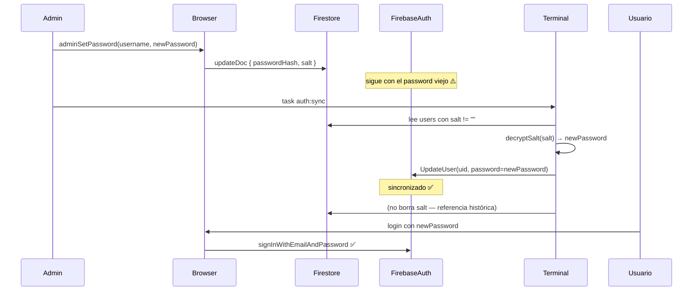
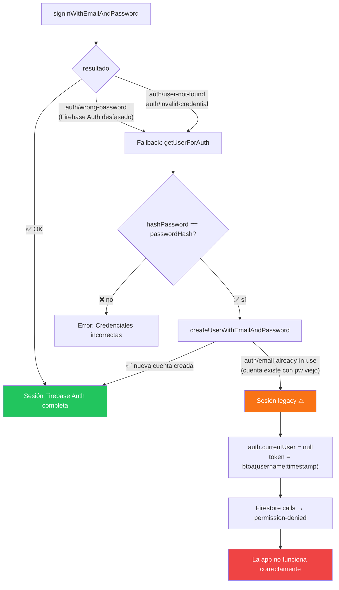

# Firebase Auth Sync — `task auth:sync`

Documenta el mecanismo de sincronización entre Firestore (hash legacy) y Firebase Auth,
y cuándo es obligatorio correr `task auth:sync`.

---

## Por qué existe

El browser no tiene acceso al Firebase Admin SDK, por lo que no puede actualizar el password
de un usuario en Firebase Auth sin conocer el password actual. Cuando un **admin resetea el
password de otro usuario**, solo puede actualizar Firestore — Firebase Auth queda desfasado.

`auth:sync` es un binario Go (`scripts/sync-firebase-auth/main.go`) que corre con credenciales
de service-account y puede llamar `authClient.UpdateUser()` sin necesitar el password anterior.

---

## Esquema de campos de password en Firestore (`users/{username}`)

| Campo | Contenido | Quién lo escribe |
|---|---|---|
| `passwordHash` | SHA-256 del password en texto plano | `createUser`, `adminSetPassword`, `updatePassword` |
| `salt` | Password en texto plano encriptado con AES-256-GCM | `createUser`, `adminSetPassword` |

`updatePassword` (auto-cambio) no escribe `salt` porque Firebase Auth se actualiza directamente
en el browser via `reauthenticateWithCredential` + `firebaseUpdatePassword`.

`updateUser` (edición de perfil por admin) no toca ningún campo de password.

---

## Flujo: admin resetea password de otro usuario



---

## Flujo: login cuando Firebase Auth está desfasado

Si el usuario intenta loguearse **antes de correr `auth:sync`**, el login no falla de forma
abrupta gracias al fallback implementado en `signIn()`:



**La sesión legacy no es funcional** — `auth.currentUser` es `null`, las reglas de seguridad
de Firestore rechazan todas las operaciones. El usuario puede completar el formulario de login
pero la app no carga datos.

---

## Cuándo correr `auth:sync`

| Acción | ¿Necesita auth:sync? |
|---|---|
| `createUser` (usuario nuevo) | No — Firebase Auth se crea en el primer login via migración lazy |
| `adminSetPassword` (admin resetea pw de otro) | **Sí — obligatorio antes de que el usuario intente entrar** |
| `updatePassword` (usuario cambia su propio pw) | No — Firebase Auth se actualiza directo en el browser |
| `updateUser` (editar nombre/rol/email) | No — no toca el password |

---

## Cómo correrlo

```bash
# Preview — muestra qué haría sin escribir nada
task auth:sync:dry

# Ejecutar (requiere notifier/service-account.json)
task auth:sync
```

Salida esperada:

```
      UPDATED  juan
      UPDATED  pedro
      SKIP     admin     — no salt field
Done — total=3 created=0 updated=2 skipped=1 errors=0
```

- `UPDATED` — Firebase Auth actualizado con el nuevo password
- `CREATED` — cuenta Firebase Auth creada (usuario nunca había entrado)
- `SKIP` — usuario sin campo `salt` (no tiene password pendiente de sync)

---

## Prerequisitos

- `notifier/service-account.json` — credenciales Firebase Admin SDK
- Go instalado (el build se compila automáticamente con `task auth:sync:build`)
- Acceso al proyecto Firebase correcto

---

## Archivos involucrados

| Archivo | Responsabilidad |
|---|---|
| `src/services/firebase/security/users.js` | `adminSetPassword`, `createUser` — escribe `passwordHash` + `salt` |
| `src/services/firebase/auth.js` | `signIn` — fallback `auth/wrong-password` → Firestore hash |
| `scripts/sync-firebase-auth/main.go` | Binario Go que sincroniza Firestore → Firebase Auth |
| `Taskfile.yml` | `auth:sync`, `auth:sync:dry`, `auth:sync:build` |
| `src/utils/cryptoHelper.js` | `encryptPassword` — AES-256-GCM usado para generar `salt` |
