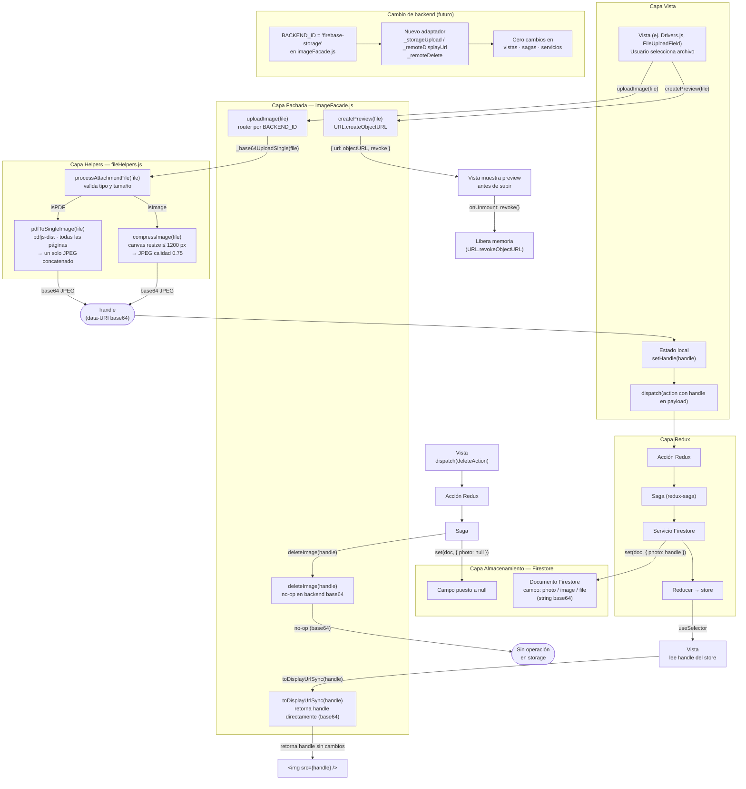

# Flujo de manejo de imágenes

Esta aplicación centraliza **todas** las operaciones de imágenes a través de `imageFacade.js`, una fachada agnóstica de backend. Las vistas y sagas nunca llaman a `fileHelpers.js` directamente ni acceden a Firebase Storage (prohibido); en su lugar, interactúan únicamente con la fachada. El backend activo se controla con la constante `BACKEND_ID` (actualmente `'base64'`): cambiarla es el único paso necesario para migrar a un backend remoto sin tocar vistas, sagas ni servicios.

---

---

## Leyenda — ¿qué es un "handle"?

Un **handle** es el valor opaco que la fachada devuelve tras subir un archivo y que se persiste directamente en Firestore. Las vistas lo tratan como una caja negra:

| Operación | Qué hace la vista con el handle |
|---|---|
| `uploadImage(file)` | Recibe el handle y lo guarda en estado local / dispatcha acción |
| `toDisplayUrlSync(handle)` | Obtiene la URL lista para `` |
| `deleteImage(handle)` | Solicita borrar el recurso en el backend |
| Inspeccionar el handle | **Nunca** — su formato es un detalle de implementación |

**Backend actual (`base64`):** el handle es el propio data-URI JPEG (`"data:image/jpeg;base64,/9j/…"`). `toDisplayUrlSync` lo devuelve sin modificar porque ya es una URL válida para el navegador. `deleteImage` es un no-op porque el dato vive dentro del documento Firestore; borrarlo significa poner el campo a `null`.

**Backend futuro (ej. Firebase Storage):** el handle sería la ruta del objeto (`"tenants/abc/drivers/xyz.jpg"`). `toDisplayUrl` haría una llamada de red para obtener una signed URL. Las vistas **no cambiarían**.
