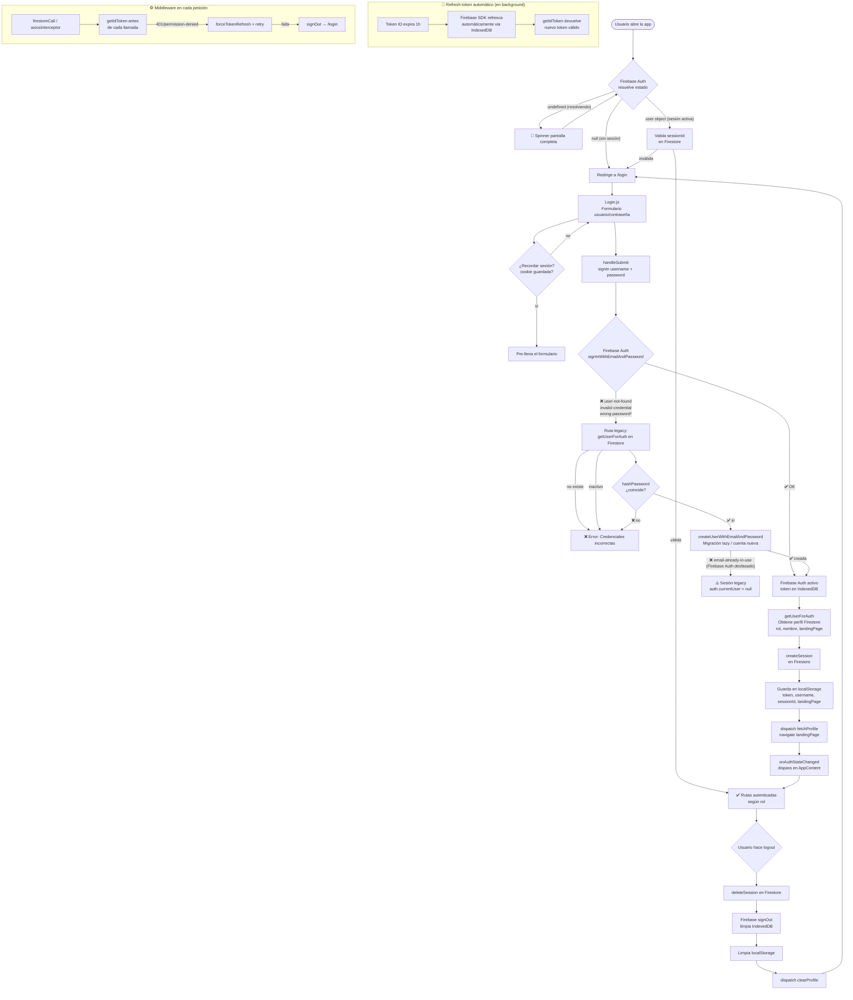

# Login Flow

Diagrama de flujo del sistema de autenticación de CashFlow.

## Puntos clave

| Etapa | Qué pasa |
|---|---|
| **Arranque** | Firebase resuelve estado desde IndexedDB antes de mostrar cualquier ruta |
| **Login normal** | `signInWithEmailAndPassword` → perfil Firestore → session record |
| **Login legacy** | `user-not-found` / `invalid-credential` → Firestore hash check → migración lazy a Firebase Auth |
| **Login con password de admin-reset** | `wrong-password` → mismo fallback legacy; si Firebase Auth tiene pw viejo, sesión queda sin token → **correr `task auth:sync` antes** (ver `docs/auth-sync.md`) |
| **Session validation** | Al arrancar con sesión activa, verifica el sessionId en Firestore (previene sesiones robadas) |
| **Refresh token** | Firebase SDK lo maneja solo en IndexedDB, sin intervención manual |
| **Middleware** | Cada llamada a Firestore/API inyecta un token fresco; en 401 fuerza refresh y reintenta |
| **Logout** | Elimina sesión Firestore + Firebase signOut (invalida IndexedDB) + limpia localStorage |

## Archivos involucrados

| Archivo | Responsabilidad |
|---|---|
| `src/views/pages/login/Login.js` | Formulario y submit handler |
| `src/services/firebase/auth.js` | `signIn`, `signOut`, `getToken`, `onAuthChange` |
| `src/components/AppContent.js` | Guard de rutas vía `onAuthStateChanged` |
| `src/services/providers/firebase/firebaseClient.js` | Middleware Firestore (token + retry + errores) |
| `src/services/providers/api/utilApi.js` | Interceptor Axios (token + retry en 401) |
| `src/services/providers/firebase/Security/sessions.js` | CRUD de sesiones en Firestore |
